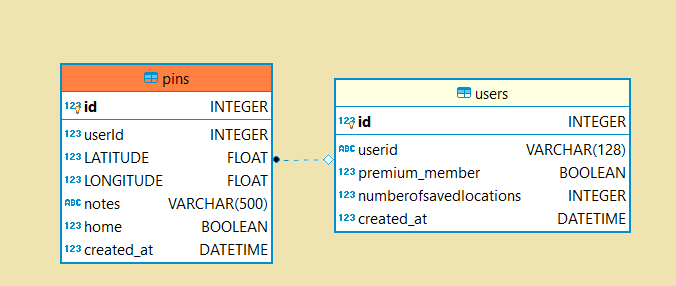

# Backend

Deployed on https://labs12.herokuapp.com/

# **Technologies**

#### Production

- [Express](https://www.npmjs.com/package/express): `Fast, unopinionated, minimalist web framework for Node.js`
- [Body parser](https://www.npmjs.com/package/body-parser): `Parse incoming request bodies in a middleware before your handlers`
- [Knex](https://www.npmjs.com/package/knex): `Knex.js is a "batteries included" SQL query builder for Postgres, MSSQL, MySQL, MariaDB, SQLite3, Oracle, and Amazon Redshift designed to be flexible, portable, and fun to use`
- [Knex-cleaner](https://www.npmjs.com/package/knex-cleaner): `Helper library to clean a PostgreSQL, MySQL or SQLite3 database tables using Knex`
- [Pg](https://www.npmjs.com/package/pg): `Non-blocking PostgreSQL client for Node.js.`
- [Sqlite3](https://www.npmjs.com/package/sqlite3): `Asynchronous, non-blocking SQLite3 bindings for Node.js.`
- [Morgan](https://www.npmjs.com/package/morgan): `HTTP request logger middleware for Node.js`
- [Cors](https://www.npmjs.com/package/cors): `CORS is a Node.js package for providing a Connect/Express middleware that can be used to enable CORS`
- [Helmet](https://www.npmjs.com/package/helmet): `Helmet helps you secure your Express apps by setting various HTTP headers`
- [Dotenv](https://www.npmjs.com/package/dotenv): `Dotenv is a zero-dependency module that loads environment variables from a .env file`
- "stripe": "^6.31.1": https://stripe.com/docs/libraries#node Stripe is a technology company based in San Francisco, California. Its software allows individuals and businesses to make and receive payments over the Internet. Stripe provides the technical, fraud prevention, and banking infrastructure required to operate online payment systems. 

#### Development

- [Nodemon](https://www.npmjs.com/package/nodemon): `nodemon is a tool that helps develop Node.js based applications by automatically restarting the node application when file changes in the directory are detected`
- [Jest](https://www.npmjs.com/package/jest): `Complete and ready to set-up JavaScript testing solution.`
- [Supertest](https://www.npmjs.com/package/supertest): `Supertest makes HTTP assertions easy via superagent.`

# Install dependencies
yarn install

# Starts express server using nodemon
yarn server

# Data Schema

# AUTH ENDPOINTS 🔒

see Auth0

# PAYMENT ENDPOINT 💸

add payment endpoints

# 📌 PINS ENDPOINTS

## POST save pin 📬 
`/pin/:id/pins`

## PUT edit pin 🔨 
`/pin/:id/pins/:id`

## GET pin by id 🎯 
`/pin/:id/pins/:id`

## DELETE pin ✂️ 
`/:id/pins/:id`

`/pin/:id/pins/:id`

*Stripe* 
  if (stripeErr) {
    res.status(500).send({ error: stripeErr });
  } else {
    res.status(200).send({ success: stripeRes });
  }
  
  POST to /payment
  form pops up requiring Email and Card information

